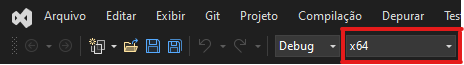
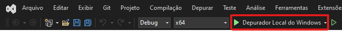

# LabirintoRatoCego

O Labirinto do Rato Cego é um jogo que tem como objetivo motivar e tornar a aprendizagem mais significativa para os estudantes de disciplinas iniciais de programação, através da teoria de Aprendizagem Significativa e da Aprendizagem Baseada em Problemas.

Nele, o jogador deve criar um código que guie um rato cego por um labirinto até a saída. O jogo é composto por três componentes: o Criador de Labirintos, a Interface do Labirinto do Rato Cego e o Rato Cego.
___
    Através do componente Criador de Labirintos, definido na classe MapRenderer, os usuários podem elaborar seus próprios mapas. É possível selecionar a altura e largura do mapa e desenhar o labirinto, definindo pontos de decisão, caminhos, pontos de início e fim, e caminhos proibidos.

___
    A Interface do Labirinto do Rato Cego proporciona aos jogadores uma visualização gráfica para selecionar configurações pré-jogo, como o labirinto, a quantidade de jogadores e o arquivo de movimento de cada rato. Por meio dessa interface, os jogadores também acompanham a movimentação de todos os ratos no labirinto, tentando encontrar a saída, e conferem o ranking final com a colocação de cada participante.

___
    O componente Rato Cego é representa a comunicação entre o arquivo ratoCego.cpp e o código criado pelo jogador. Com essa comunicação é criado o arquivo de movimento do rato, que é utilizado pela Interface do Labirinto do Rato Cego para simular a movimentação do rato no labirinto.


## Como rodar

- **Instalação das Bibliotecas:** certifique-se de ter as bibliotecas necessárias instaladas: [SDL2](https://lazyfoo.net/tutorials/SDL/01_hello_SDL/index.php), [SDL2_ttf](https://github.com/libsdl-org/SDL_ttf/releases) e [SDL2_image](https://github.com/libsdl-org/SDL_image/releases)
  
[Link](https://lazyfoo.net/tutorials/SDL/06_extension_libraries_and_loading_other_image_formats/index.php) ensinando a instalar e configurar bibliotecas adicionais (as bibliotecas usadas no Labirinto do Rato Cego seguem o mesmo guia).
- **Clone do Repositório no GitHub**

### Sistemas baseados em Linux

#### Interface do Labirinto do Rato Cego
Passos para a execução do componente Interface do Labirinto do Rato Cego:
- Passo 1: estando no diretório raiz do repositório execute o makefile
```cmd
make
```
- Passo 2: estando no diretório raiz do repositório execute o programa com o comando:
```cmd
./RatoCego
```

#### Criador de Labirintos
Passos para a execução do componente Criador de Labirintos:
- Passo 1: estando no diretório raiz do repositório execute o makefile:
```cmd
make
```
- Passo 2: estando no diretório raiz do repositório execute o programa com o comando:
```cmd
cd CriadorLabirinto && ../MapGenerator
```

#### Rato Cego
Passos para a execução do componente Rato Cego:
- Passo 1: acesse o diretório **/RatoCego** do repositório
- Passo 2: compile o arquivo **ratoCego.cpp** com o comando:
```cmd
g++ ratoCego.cpp -o rc
```
- Passo 3: compile, se necessário, o código criado pelo jogador
- Passo 4: crie o arquivo FIFO com o comando:
```cmd
mkfifo tmpfifo
```
- Passo 5: estabeleça a comunicação entre o **ratoCego.cpp** e o código do jogador via **pipe** com o comando:
```cmd
timeout 3s codigo_jogador < tmpfifo | ./rc ../assets/maps/mapa.txt > tmpfifo
```

### Windows

#### Interface do Labirinto do Rato Cego
Passos para a execução do componente Interface do Labirinto do Rato Cego:
- Passo 1: abra o projeto **LabirintoRatoCego.sln**, localizado na pasta raiz do repositório, utilizando o Visual Studio 2022.
- Passo 2: certifique-se de que a configuração de compilação está definida para x64.

- Passo 3: use o Depurador Local do Windows (Local Windows Debugger) para construir e executar o jogo.


#### Criador de Labirintos
Passos para a execução do componente Criador de Labirintos:
- Passo 1: abra o projeto **CriadorLabirinto.sln**, encontrado no caminho **LabirintoRatoCego/CriadorLabirinto/** do repositório, no Visual Studio 2022.
- Passo 2: certifique-se de que a configuração de compilação está definida para x64.

- Passo 3: use o Depurador Local do Windows (Local Windows Debugger) para construir e executar o programa.


#### Rato Cego
[Link](https://learn.microsoft.com/pt-br/windows/wsl/install) da própria Microsoft ensinando a configurar o WSL2
Passos para a execução do componente Rato Cego no Windows (necessário WSL2):

- Passo 1: abra o terminal do WSL2.
- Passo 2: acesse o diretório **/RatoCego** do repositório:
- Passo 3: compile o arquivo **ratoCego.cpp** com o comando:
```cmd
g++ ratoCego.cpp -o rc
```
- Passo 4: compile, se necessário, o código criado pelo jogador
- Passo 5: crie o arquivo FIFO com o comando:
```cmd
mkfifo tmpfifo
```
**OBS.:** Caso esse comando não funcione no terminal que está aberto o repositório, faça o comando no diretório raiz do WSL, acesse esse diretório com o comando:
```cmd
cd ~
```
Para voltar para o diretório do jogo, o comando é:
```cmd
cd /mnt/letra_disco/caminho_para_o_repositorio/
```
Criando a FIFO no diretório raiz, o caminho para acessá-la no passo 6 será:
```cmd
~/tmpfifo
```
- Passo 6: estabeleça a comunicação entre o **ratoCego.cpp** e o código do jogador via **pipe** com o comando:
```cmd
timeout 3s codigo_jogador < tmpfifo | ./rc ../assets/maps/mapa.txt > tmpfifo
```
